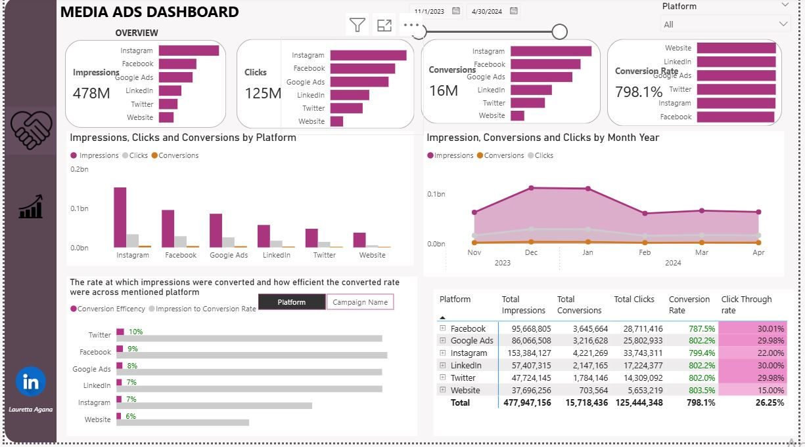
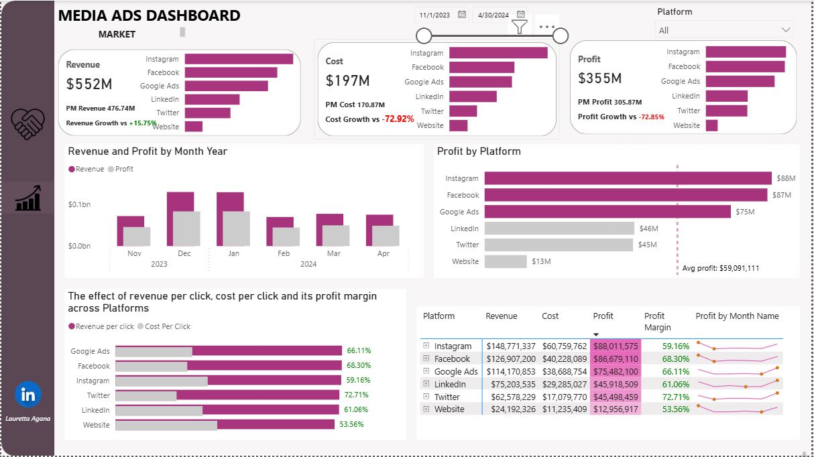
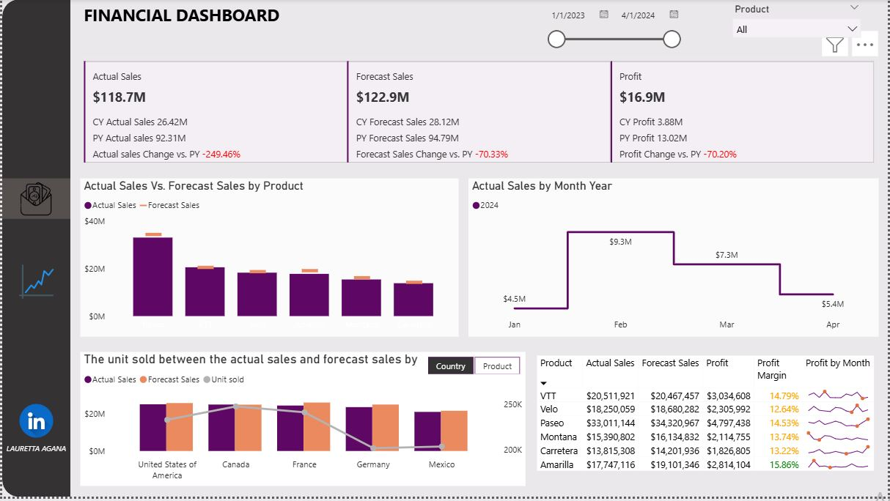
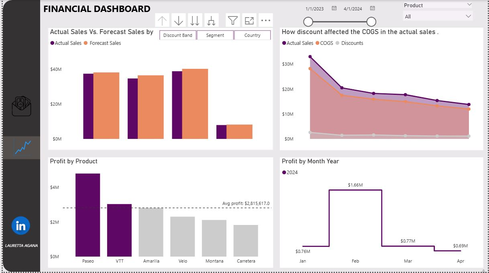

# ABOUT ME 
As a data analyst, I specialize in transforming complex data into clear, actionable insights. Utilizing a range of tools including Excel, Power BI, SQL, my skills involves data extraction, cleaning, and modeling. I am dedicated to using data-driven solutions to solve business problems. I utilize my ability to clean, analyze, and visualize data, turning raw information into an insight narrative that guides strategic decisions.
My work is focused on creating insightful analysis and dashboards that not only answer critical questions but also empower stakeholders to make informed decisions.
I used my skills in data manipulation and visualization to uncover key trends and patterns, providing a clear, evidence-based perspective on the subject matter.

##MY PROJECT

## Media advertising performance optimization (November 2023- April 2024)
* A media ads optimization project to address inefficient performance and increased cost across platforms through a media campaign.*

 
Media advertising performance optimization.pdf

##Sales Performance Gap Analysis and Discount Strategy Optimization
*….by examining how product performed regionally and the influence discount had on each product.*

Sales Performance Gap Analysis and Discount Strategy Optimization.pdf

##Investment Efficiency and Market Dynamics in the Global Unicorn Community: An Analysis of ROI Patterns and Industry Performance (2012-2022)
*…investigating how investment is efficient across sectors and what geographic region play a vital role in unicorn community.*

.JPG)
 II.JPG)

Investment Efficiency and Market Dynamics in the Global Unicorn Community.pdf

CONTACT
Email                            aganachiamaka2018@gmail.com
Phone Number                     +234 7065242164
Location                         Lagos, Nigeria.
CV Link                         Resume - Data Analyst Original (1).pdf

